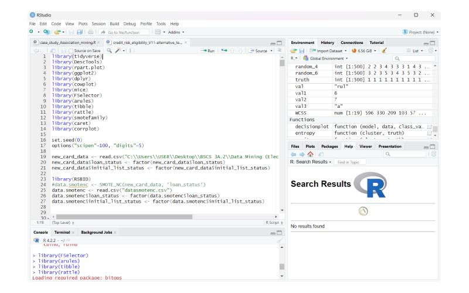

# **Credit Risk Binary Classification**

A Case study analyzing the performance of different classification algorithms against loan risk data.

We created a predictive classification model using R to predict if a customer is likely to default their loan or not, helping make informed decisions about which loan applications to approve.

Additionaly, we compared the difference between Hold-out and Cross-Validation method for splitting the testing and training partitions, as well as different split percentages.

---
 

## **Data Cleaning**

The original dataset can be found [here](https://www.kaggle.com/datasets/shadabhussain/credit-risk-loan-eliginility).

+ Handling Missing Data
    - Columns irrelevant to the classifier such as `member_id`,  `zip_code`, `addr_state` etc. were dropped.
    - Columns where the majority of data have missing values *(at about 50%)* were also removed. 
+ Feature Selection
    - asas
    - asa
    - Asa  
    
+ Data Type Preparation
    - asa
+ Data Augmentation
    - asa

## **Test-Train Partition**
> 