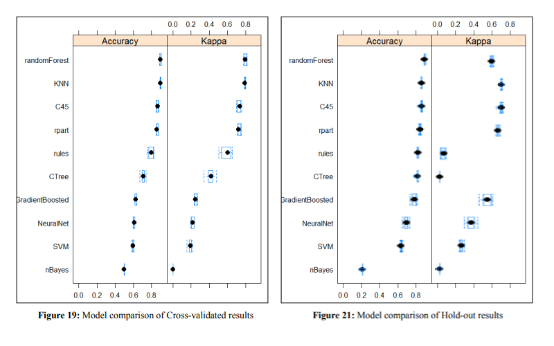

# **Credit Risk Binary Classification**

A Case study analyzing the performance of different classification algorithms against loan risk data.

We created a predictive classification model using R to predict if a customer is likely to default their loan or not, helping make informed decisions about which loan applications to approve. The target variable `loan_status` is a binary class where **0** stands for eligible and **1** being not eligible for a loan.

Additionaly, we compared the difference between Hold-out and Cross-Validation method for splitting the testing and training partitions, as well as different split percentages.

---
 

# **Data Preparation**

The original dataset was retrieved from [Kaggle](https://www.kaggle.com/datasets/shadabhussain/credit-risk-loan-eliginility).

+ Handling Missing Data
    - Columns irrelevant to the classifier such as `member_id`,  `zip_code`, `addr_state` etc. were dropped.
    - Columns where the majority of data have missing values *(greater than 50%)* were also removed. These were the columns named `batch_enrolled`, `emp_title`, `mnths_since_last record`, `mnths_since_last_major_derog`, etc.  
+ Data Type
    - After removing the problematic features, we are left with a data frame with only 31 variables.
    -  We then transformed the data types of the columns to be more appropriate for model learning. Ordinal values such as `loan_status` *(the class variable)*, `grade`, `verification_status`, and others are turned into factors instead of characters.
    - The remaining missing values were handled by dropping the rows containing such instances.  
+ Balancing the Class Variable
    - The original distribution of the class variable is unbalanced, wherein 80% have the value **0** and 20% are **1**.  
     
    - In order to remove the bias towards the negative value in training the model, the researchers tried using the Synthetic Minority Oversampling Technique (SMOTE) and the undersampling technique in balancing the class variable.  
+ Feature Preparation
    - Feature selection is the method of reducing input variables by using only relevant data and getting rid of noise in data. The researchers obtained the Univariance Feature Importance Score of each variable in order to select the only relevant features. Different methods for finding feature importance was used: **Chi-square test** and **Information Gain ratio**, **Correlation/Entropy with Best First Search**, and **Black-box feature selection** 
      
    - In the chi-square test statistic, we first discretized the numeric and int variables to convert them as factors with 5 levels. After this, the algorithm outputs the top five variables, which are last_week_pay, initial_list_status, term, verification_status, and dti. 
     
    - Computing the univariate feature importance score using the **information gain ratio**, the algorithm outputs the top five variables with the highest gain which are recoveries, collection_recovery_fee, last_week_pay, int_rate, and initial_list_status. 
    - The **cfs method** stated that the variables int_rate, initial_list_status, recoveries, and last_week_pay, respectively, are the most important features.
    - In the **black-box feature selection**, the five most important features are loan_amnt, term, int_rate, emp_length, and home_ownership as least important.
    - Additionally, the researchers tried greedy search strategies to find the most important features. Both **forward-search** and **best-first search** identified last_week_pay as the most important feature. **Hill-climbing search** identified recoveries as the most important attribute, followed by last_week_pay, then initial_list_status.
    - The researchers decided to pick the top 5 features using the information gain ratio method of the balanced dataset. The top 5 features are `recoveries`, `collection_recovery_fee`, `last_week_pay`, `int_rate`, and `initial_list_status`.

 

# **MODELING & RESULTS**
The researchers used ten classification algorithms in performing binary
classification of the dataset. 

## Classification and Regression Tree (CART)

| Data Set | Split | Accuracy | Kappa |
|:--:|:--:|:--:|:--:|
| Balanced | Cross Validation | .862 | .725 |
| Balanced | Hold-out | .844 | .688 |
| Unbalanced | Cross Validation | .893 | .611 |
| Unbalanced | Hold-out | .886 | .592 |

**complexity parameter (cp) held at constant value 0.*

The CART algorithm is used to build a decision tree that predicts the loan
eligibility status of an applicant based on the given attributes.

 

## K Nearest Neighbors (kNN)

| Data Set | Split | Accuracy | Kappa |
|:--:|:--:|:--:|:--:|
| Balanced | Cross Validation | .897 | .794 |
| Balanced | Hold-out | .863 | .725 |
| Unbalanced | Cross Validation | .920 | .717 |
| Unbalanced | Hold-out | .890 | .604 |

**neighbors (k) held at constant value 1.*

The KNN algorithm is used to predict loan eligibility by identifying the k nearestvneighbors of a new loan applicant based on their attributes. The algorithm wouldbcalculate the distance between the new applicant and each existing applicant in the dataset and select the k nearest neighbors.

 

## Rule Based Classification

| Data Set | Split | Accuracy | Kappa |
|:--:|:--:|:--:|:--:|
| Balanced | Cross Validation | .796 | .592 |
| Balanced | Hold-out | .791 | .583 |
| Unbalanced | Cross Validation | .876 | .528 |
| Unbalanced | Hold-out | .770 | .540 |

The KNN algorithm is used to predict loan eligibility by identifying the k nearestvneighbors of a new loan applicant based on their attributes. The algorithm wouldbcalculate the distance between the new applicant and each existing applicant in the dataset and select the k nearest neighbors.

 

## Linear Support Vector Machine (SVM)

| Data Set | Split | Accuracy | Kappa |
|:--:|:--:|:--:|:--:|
| Balanced | Cross Validation | .597 | .194 |
| Balanced | Hold-out | .597 | .193 |
| Unbalanced | Cross Validation | .804 | .0 |
| Unbalanced | Hold-out | .804 | .0 |

**neighbors (k) held at constant value 1 .*

The KNN algorithm is used to predict loan eligibility by identifying the k nearestvneighbors of a new loan applicant based on their attributes. The algorithm wouldbcalculate the distance between the new applicant and each existing applicant in the dataset and select the k nearest neighbors.

 

## Random Forest

| Data Set | Split | Accuracy | Kappa |
|:--:|:--:|:--:|:--:|
| Balanced | Cross Validation | .899 | .797 |
| Balanced | Hold-out | .871 | .743 |
| Unbalanced | Cross Validation | .921 | .721 |
| Unbalanced | Hold-out | .893 | .616 |

**hyperparameter mtry held at constant value 5 .*

Random Forest `method=rf` works by combining the predictions of multiple
decision trees to make more accurate and robust predictions. A collection of decision trees is constructed using a technique called "bagging." Bagging involves randomly selecting subsets of the training data, with replacement, to create multiple subsets of the data. Each subset is then used to train an individual decision tree. 

 

## Naive Bayes Classifier

| Data Set | Split | Accuracy | Kappa |
|:--:|:--:|:--:|:--:|
| Balanced | Cross Validation | .50 | 0 |
| Balanced | Hold-out | .50 | 0 |
| Unbalanced | Cross Validation | .197 | 0 |
| Unbalanced | Hold-out | .197 | 0 |

Naive Bayes, was implemented through caret's method 'nb'. It is a simple
probabilistic classifier based on Bayes' theorem with the assumption of independence between features.

 

## Artificial Neural Network

| Data Set | Split | Accuracy | Kappa |
|:--:|:--:|:--:|:--:|
| Balanced | Cross Validation | .609 | .218 |
| Balanced | Hold-out | .604 | .208 |
| Unbalanced | Cross Validation | .808 | .070 |
| Unbalanced | Hold-out | .809 | .069 |

A neural network is an artificial intelligence technique that enables computers to process data in a manner resembling the human brain. The package commonly used for artificial neural networks in R is called "nnet." It provides functions and tools for building, training, and evaluating neural network models. A grid of hyperparameter values, determined by the expand.grid function, is used to fine-tune the neural network model.

 

## Conditional Inference Tree

| Data Set | Split | Accuracy | Kappa |
|:--:|:--:|:--:|:--:|
| Balanced | Cross Validation | .714 | .429 |
| Balanced | Hold-out | .713 | .426 |
| Unbalanced | Cross Validation | .843 | .322 |
| Unbalanced | Hold-out | .840 | .313 |

**mincriterion held at constant value 0.01 .*

Conditional inference trees offer flexibility in handling both categorical and continuous predictor variables, as well as handling missing values. It starts by setting a seed value for reproducibility and creates fold indices using the createFolds.

 

## C4.5

| Data Set | Split | Accuracy | Kappa |
|:--:|:--:|:--:|:--:|
| Balanced | Cross Validation | .866 | .731 |
| Balanced | Hold-out | .847 | .694 |
| Unbalanced | Cross Validation | .872 | .496 |
| Unbalanced | Hold-out | .868 | .466 |

**C held at constant value 0.5; M held at constant value 1.*

The J48 algorithm in R from the package caret and RWeka is used with the
method set to 'J48'. This constructs decision trees based on the C4.5 algorithm, which uses attribute selection, recursive splitting, handling of missing values, and pruning to create an interpretable model for classification tasks.

 

## Gradient Boosted Decision Tree

| Data Set | Split | Accuracy | Kappa |
|:--:|:--:|:--:|:--:|
| Balanced | Cross Validation | .626 | .252 |
| Balanced | Hold-out | .628 | .256 |
| Unbalanced | Cross Validation | .813 | .083 |
| Unbalanced | Hold-out | .815 | .098 |

When using the XGBoost model for classification, it follows a boosting
framework where an ensemble of decision trees is constructed iteratively. Each decision tree is built to correct the mistakes made by the previous trees. 

 

## Box Plot of the Model Performance from a Balanced Data
 

---
  

# **CONCLUSION**

1. **Cross-validation is a better partitioning method** for test and train sets to create a classification model, when compared to the hold-out method. Using different folds for testing and training noticeably increases the accuracy of classification models, compared to using only a fixed set and number of testing and training partitions.

2. It is important to make sure the class variable is balanced, otherwise the accuracy metric for the various classification models would be misleading because of the skewed distribution.

3. The kappa statistic an important evaluation metric for the
performance of the classifier especially when the data is unbalanced, compared to the percentage of cases classified accurately, since kappa compares the observed accuracy (proportion of cases classified accurately) to random chance (expected accuracy).

4. The **random forest algorithm** produces well performing classifiers that use both categorical and numerical values to infer a predicted class. Even with an unbalanced data set, it performs relatively better compared to other algorithms that suffer with low kappa values when training with unbalanced data.
